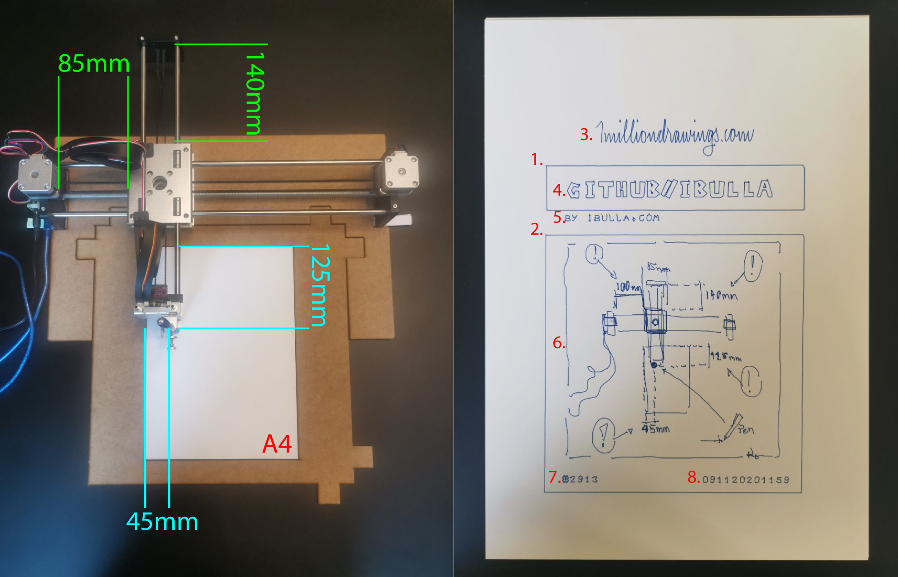

# axi-1milliondrawings

Python script for working with the [AxiDraw](https://www.axidraw.com/) v3 pen plotter (and any cheap alibaba copy ;)\
driven by the unofficial library "axi" [by fogleman](https://github.com/fogleman/axi)\
[the script](plotter.py) will plot any drawing created via [wedodraw.com](https://wedodraw.com/)

## Update: Website Change

The project, originally available on [1milliondrawings.com](https://1milliondrawings.com/), has now been moved to [wedodraw.com](https://wedodraw.com/). All the functionalities remain the same, and users can continue to create, modify, and plot their drawings using the new website. Please update your bookmarks and references to point to the new domain.

## Basics

- Once you have installed the library and connected your plotter, you can perform cool stuff via the console.
- Go to [wedodraw.com](https://wedodraw.com/), create a login, draw your own, or just play around with one of the existing drawings.

## Files

- [Script to plot your drawing](plotter.py)
- [Template to create the paper holder](axi_platten1.ai) (Illustrator file)

## Preparation

- [x] Place the pen and paper as described in the picture.
- [ ] Start the script, try out drawing number 2913 ;)

## Step by Step (plotter.py)

- First, you are asked for the drawing ID; if you leave it blank, a random drawing is pulled.
- Next, you see some information about the drawing, including how many lines will be drawn, the title, etc.
- If you type "y," the plotting will start as follows; with "n," you can stop it.
- Now the machine comes to life:
  - *1./ 2.)* Two rectangles are drawn.
  - *3.)* The logo is drawn on the top.
  - Now the data from wedodraw.com comes into play.
  - *4./ 5.)* The title and author are plotted.
  - *6.)* The drawing itself is drawn; lines are ordered by the starting point, left to right.
  - *7./ 8.)* At the bottom, the drawing ID and date of the print are plotted.
  - End.

## Emergency Shutdown

- Kill the script or pull the plug.
