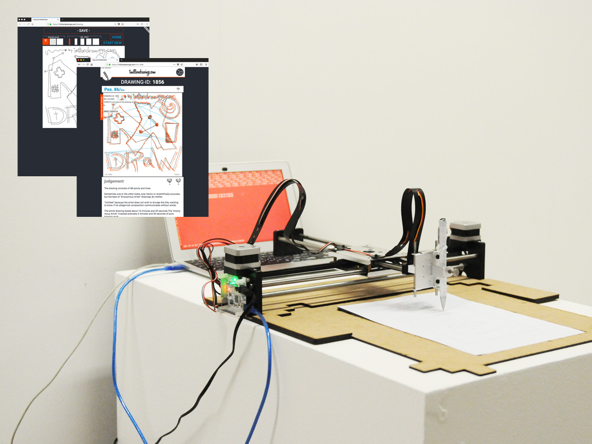

# axi-1milliondrawings
Python script for working with the [AxiDraw](https://www.axidraw.com/) v3 pen plotter (and any cheap alibaba copy ;)\
driven by the unoffical library "axi" [by fogleman](https://github.com/fogleman/axi)\
[the script](plotter.py) will plot any drawing created via [1milliondrawings.com](https://1milliondrawings.com/)

## basics
- once you installed the library and connected your plotter you could perform cool stuff via the console
- go to [1milliondrawings.com](https://1milliondrawings.com/), create a login, draw your own or just play around with one of the existing drawings

## files
- [Script to plot your drawing](plotter.py)
- [Template to create the paper holder](axi_platten1.ai)

## prepration
- [x] place the pen and paper like described in the picture
- [ ] start the script, try out nr 2913 ;)

## script step by step (plotter.py)
- first you get asked for the drawing-ID, if you leave if free a random drawing gets pulled
- now you see some informations about the drawing, you see how many lines will get drawn, the title ect.
- if you type in "y" it will start as fallow, with "n" you can stop it
- now the machine comes to live:
 - 1.) 2.)two rectangles are drawn
 - 3.) the logo gets drawn on the top
 - now the data from 1milliondrawings.com come to play
 - 4.) 5.) titel and author get ploted
 - 6.) the drawing itself gets drawn, lines are ordered by starting point, left to right
 - 7.) 8.) on the bottom the drawing-ID and date of print are ploted
 - end.

## emergency shutdown
- kill the script or pull the plug
